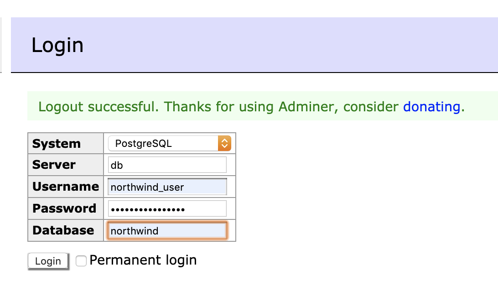

# Docker Northwind Database Container for Postgres

Create a [northwind](https://docs.microsoft.com/en-us/dotnet/framework/data/adonet/sql/linq/downloading-sample-databases) 
database in a docker container, adapted for PostgreSQL.

**NOTE:** This setup is **NOT** suitable for a production environment. This is only suitable
as an example and allow you to practice your SQL knowledge. Why? Username and password should
never be checked into source control, but they are here for simplicity.

## Entity Relationship Diagram (ERD)

The initial ERD for Microsoft SQL is as follows:


*SQL Server ERD*

Some modifications have been made for PostgreSQL and they are as follows:


*PostgreSQL ERD*

You can find several examples of this database in the [w3schools.com tutorials](https://www.w3schools.com/sql/default.asp). 
You should take note that there are variations to the schema, where snake case naming convention is used.

## Requirements

- [Docker](https://www.docker.com/get-started)

## Installation

```bash
$ docker-compose up
```

Once installed you should be able to go to the `Adminer` page at http://localhost:8080, where
you should see the login.


*Adminer Login Page*

You should enter the environment variables you have specified in your `docker-compose.yml` to login.

The following are some common database concepts that are asked in technical interviews, you should familiarize 
yourself with them prior to the interview(s).


## SQL JOIN

A `JOIN` clause is used to combine rows from two or more tables, from related column between the tables.

### INNER JOIN

The `INNER JOIN` selects records that have matching values on both tables.

```postgresql
SELECT orders.order_id, customers.contact_name
  FROM orders
  INNER JOIN customers ON orders.customer_id = customers.customer_id;
```

### LEFT JOIN

The `LEFT JOIN` keyword returns all records from the left table (table1), and the matched records from the right table
(table2). If there is no matching value on the right side, then the result is `NULL`.

```postgresql
SELECT customers.contact_name, orders.order_id
  FROM customers
  LEFT JOIN orders ON customers.customer_id = orders.customer_id
  ORDER BY customers.contact_name;
```

### RIGHT JOIN

The `RIGHT JOIN` returns all records from the right table (table2), and the matching records from the 
left table (table1). When there is no match the result is `NULL` from the left side.

```postgresql
SELECT orders.order_id, employees.last_name, employees.first_name
  FROM orders
  RIGHT JOIN employees ON orders.employee_id = employees.employee_id
  ORDER BY orders.order_id;
```

### FULL OUTER JOIN

The `FULL OUTER JOIN` returns all records if there is a match or not. Be careful as `FULL OUTER JOIN` can potentially
return extremely large result-sets!

```postgresql
SELECT customers.contact_name, orders.order_id
  FROM customers
  FULL OUTER JOIN orders ON customers.customer_id=orders.customer_id
  ORDER BY customers.contact_name;
```

## GROUP BY

The `GROUP BY` does what it sounds like, it groups rows that have the same values into summary rows. It is often used
is combination with aggregate functions.

```postgresql
SELECT COUNT(customer_id), country
  FROM customers
  GROUP BY country
  ORDER BY COUNT(customer_id) DESC;
```

## HAVING

The `HAVING` clause was added because the `WHERE` keyword could not be used with aggregate functions. This is one that 
you can easily forget and many will try to trick you because you instinctually want to use the `WHERE` keyword.  

```postgresql
SELECT COUNT(customer_id), country
  FROM customers
  GROUP BY country
  HAVING COUNT(customer_id) > 5;
```

## Aggregate functions

### AVG

Returns the average value of a numeric column.

```postgresql
SELECT AVG(unit_price) FROM products;
```

### COUNT

Returns the number of rows that match a specific criteria.

```postgresql
SELECT COUNT(product_id) FROM products;
```

### MAX

Returns the largest value of the selected column.

```postgresql
SELECT MAX(unit_price) AS largest_price
FROM products;
```

### MIN

Returns the smallest value of the selected column.

```postgresql
SELECT MIN(unit_price) AS largest_price
FROM products;
```

### SUM

Returns the total sum of a numeric column.

```postgresql
SELECT SUM(quantity) FROM order_details;
```

## EXISTS

The `EXISTS` operator is used to test for the existence of any record in a subquery.

```postgresql
SELECT company_name
  FROM suppliers
  WHERE EXISTS 
    (SELECT product_name FROM products WHERE products.supplier_id = suppliers.supplier_id AND unit_price < 20);
```

## Stored Procedures

A stored procedure is SQL code that you save that can be used over and over again.

```postgresql
CREATE PROCEDURE SelectAllCustomers
  AS 
  SELECT * FROM customers 
GO;
```

Execute the stored procedure above as follows:

```postgresql
EXEC SelectAllCustomers;
```
---
A stored procedure can also have parameters:

```postgresql
CREATE PROCEDURE SelectAllCustomers @city nvarchar(30)
  AS
  SELECT * FROM customers WHERE city = @city
GO;
```

Execute the stored procedure above as follows:

```postgresql
EXEC SelectAllCustomers city = "London";
```

## Comments

All single line comments start with `--`. Multiple line comments start with `/*` and end with `*/`.

## VIEW

A `VIEW` is a virtual table based on the results of a SQL statement. A view always shows up to date data, where the
data is recreated every time a user queries a view.

```postgresql
CREATE VIEW [roducts Above Average Price] AS
  SELECT product_name, unit_price
  FROM products
  WHERE unit_price > (SELECT AVG(unit_price) FROM products);
```

You can query the view above as follows:

```postgresql
SELECT * FROM [Products Above Average Price];
```

## Injection

SQL injection is a code injection technique that can destroy your database and one of the most
common web hacking techniques that places malicious code in SQL statements. Many web developers
use ORMs that protect against this.

## Database information

If you don't have access to the schema easily, you can view your public tables as follows:

```postgresql
SELECT table_name, table_type, table_schema 
  FROM information_schema.tables 
  WHERE table_schema='public';
```
